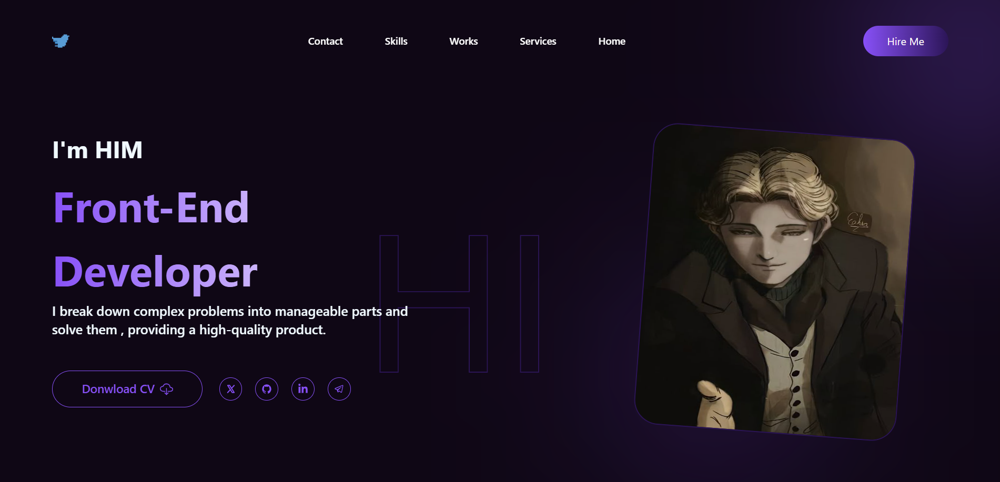
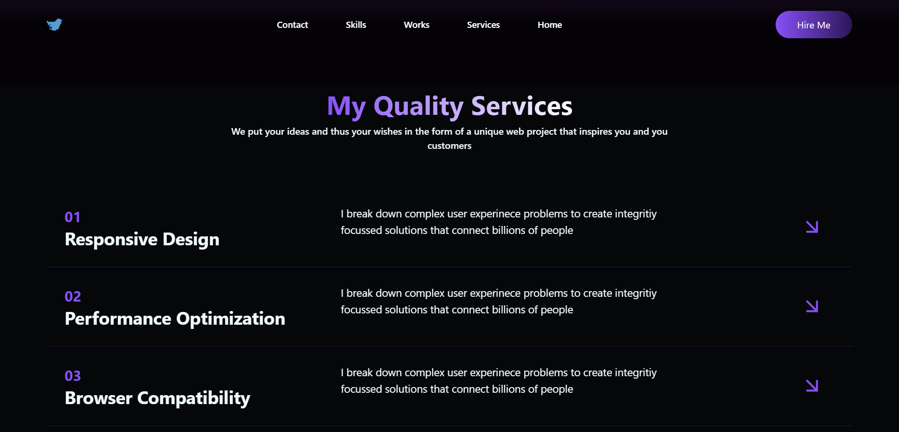
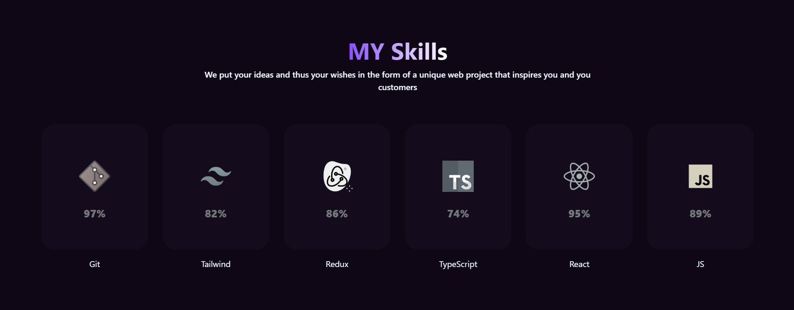
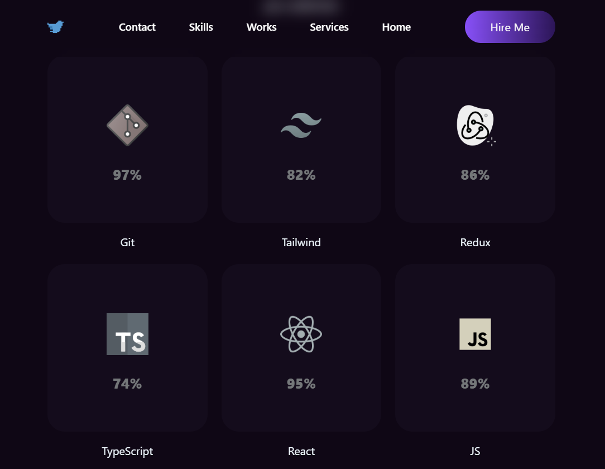
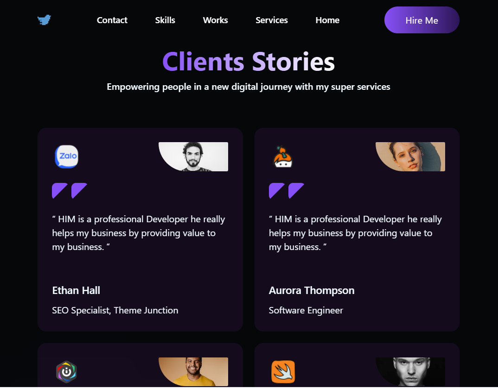
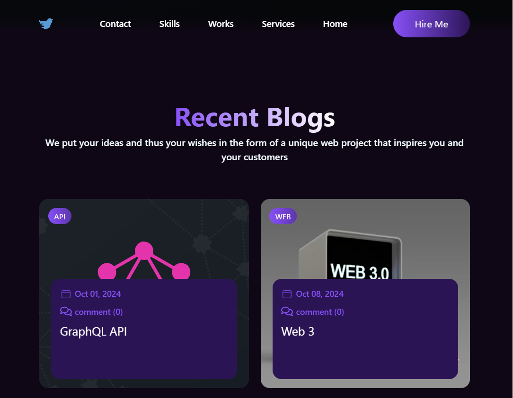
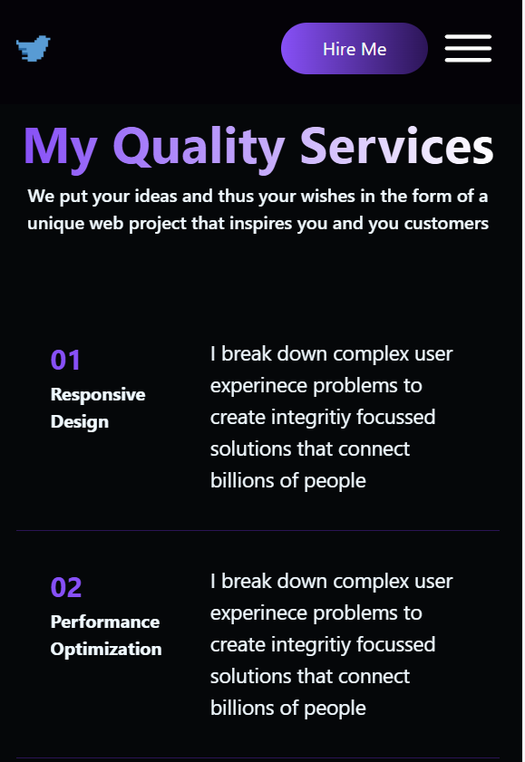
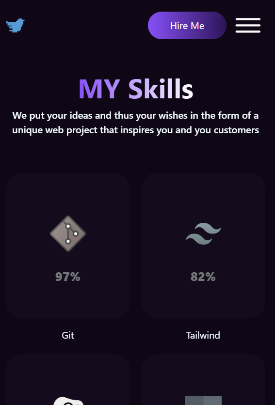

# portfolio


This portfolio functions as a demonstration of my programming abilities. In this project, I have employed the latest technologies in web programming to showcase my skills in user interface design, interactive programming, and the development of modern applications .


<p dir="rtl" style="text-align: right;">
این پورتفولیو به عنوان نمایشی از توانمندی‌های برنامه‌نویسی من عمل می‌کند. در این پروژه، از آخرین فناوری‌های برنامه‌نویسی وب استفاده کرده‌ام تا مهارت‌هایم را در طراحی رابط کاربری، برنامه‌نویسی تعاملی و توسعه اپلیکیشن‌های مدرن به نمایش بگذارم.
</p>
- 

## Tech

- React
- Css
- Tailwind css
- Axios
- json server
- react-router
- react-icons

## Installation

Protfolio requires [Node.js](https://nodejs.org/) v18+ to run.

Install the dependencies start the server.

<p dir="rtl" style="text-align: right;">
پورتفولیو نیازمند [Node.js](https://nodejs.org/) ورژن 18 یا بالاتر برای راه اندازی میباشد


وابستگی‌ها را نصب کنید و سرور را راه‌اندازی کنید.
</p>

```sh
cd PORTFOLIO
npm install
```

```sh
npx json-server data/data.json -p 8001
npm run dev  or npm start
```

## Screenshots

- Desktop





- Tablet





- Mobile





